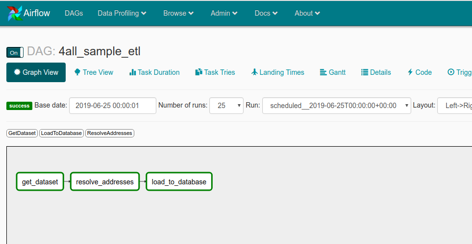
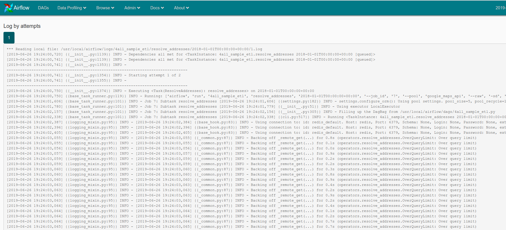
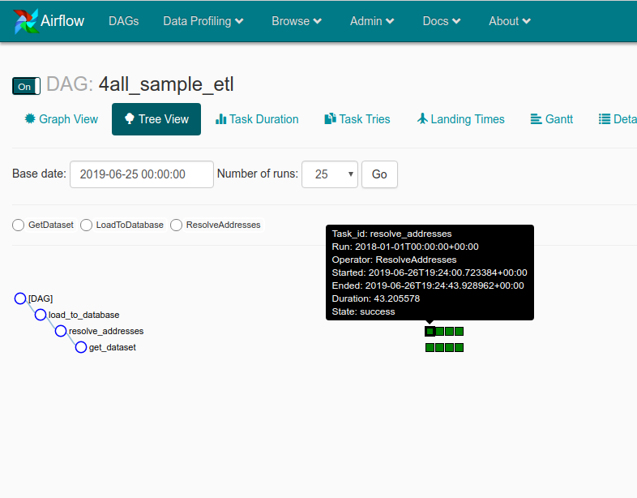

# 4all: ETL baseado em Airflow


## Por que o Airflow e não um script [KISS](https://en.wikipedia.org/wiki/KISS_principle) de 50 linhas?

Embora a necessidade de transformação em sí seja simples, resolvi adotar um caminho
[over-engineered](https://en.wikipedia.org/wiki/Overengineering) com o Airflow com o intuito de simular 
um ambiente de produção de intenso ETL (também excluí alternativas onde o python não é first-class citizen, como Spark).

## Design

Segue a visualizão do processo:



Onde

* get_dataset: **E**xtract: Operador para captura os arquivos.
* resolve_address: **T**ransform: Operador que agrega os dados do Google Maps.
* load_to_database: **L**oad: Salva os dados no postgres, na tabela sample_output.

Pontos positivos da solução:

* [Idempotente](https://en.wikipedia.org/wiki/Idempotence): Pode rodar diversas vezes os mesmo dados e refazer backfill sem duplicar o resultado final. 
* Escalável: Permite executores em diferentes máquinas e pode ganhar paralelismo adicional diminuindo o intervalo de `@daily` para `@hourly` por ex.
* Reutilizável com cada operador com parametros `input` / `output`.
* Fácil adaptar as abstrações que salvam os dados intermediários (`IntermediateRead` / `IntermediateWrite`) para o S3 ou EFS para fazer off-load (atualmente é salvo no Redis).

Pontos negativos:

* Complexidade e overhead com cada etapa salvando dados intermediários.
* Airflow é muito bom para orquestrar, mas dependendo do volume de dados o executor não é o mais adequado e pode ser interessante criar operadores que fazerem o off-load das tasks mais intensivas para o Spark ou Google Bigquery por ex.

# Performance

O maior gargalo para escaleonar essa aplicação é a API do Google Maps. Utilizei o ```asyncio``` que é uma das formas mais eficientes de realizar requests assíncronos no python, porém com apenas 40 conexões de simultâneas (configurado em `airflow/setup/variables.json`) é retornado centenas de erros `OVER_QUERY_LIMIT`, o que instruí a aplicação fazer um exponencial backoff e reduzir o request rate.



Por conta dos erros que nos forçam a aliviar a carga na API o processamento de um único arquivo fornecido me levou **43s**.



Estratégias possíveis:

1) Cache agressivo de query passadas: aproveitar que ruas não mudam de lugar e nome todo dia :-).
2) Negociar com o Google?
3) Normalizar localização em "micro-regiões", seja 1m2, 5m2, 30m e etc. Abrimos mão de precisão para diminuir o ruído e aumentar o cache hit.
4) Usar múltiplas API keys e/ou IPs.
5) Usar outro serviço.

## Principais diretórios e arquivos

    ├── airflow
    │   ├── dags                             # Código fonte
    │   │   ├── 4all_sample_etl.py           # Definições da DAG
    │   │   ├── operators
    │   │   │   ├── extract.py               # (E)xtract: Operador de captura os arquivos
    │   │   │   ├── resolve_addresses.py     # (T)ransform: Operador que agrega os dados do Google Maps
    │   │   │   ├── save_to_postgres.py      # (L)oad: Salva os dados no postgres, tabela sample_output
    │   │   │   └── utils.py
    │   │   └── tests                        # Unit test
    │   ├── postgres
    │   │   └── initialize.sql               # Esquema SQL: Esquema padrão do DB
    │   ├── sample-dataset                   # Dataset de exemplo: O dataset fornecido para o teste
    │   ├── setup
    │   │   ├── variables.json               # Configurações: Variáves padrões
    │   │   └── webserver.sh
    ├── docker-compose.yml
    ├── Makefile                             # Makefile: Facilita os comandos usados no projeto organizados.
    └── README.md

## Como rodar

1. Baixe o repositório e vá para o diretório.

    ```bash
    git clone https://www.github.com/meirelles/4all-etl && cd 4all-etl
    ```

2. Inicialize os containers docker.

    ```bash
    make run
    ```

3. Aguarde alguns instantes e acesse a página http://localhost:8080/admin/. Será possível acompanhar os dados do dataset de exemplo serem processados em backfill automaticamente.

4. Para rodar os testes (opcional).

    ```bash
    make tests
    ```

4. Para limpar e remover todos os containers, imagens baixadas e vestígios do sistema.

    ```bash
    make clean
    ```

